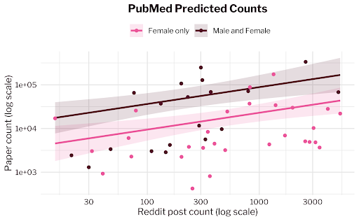
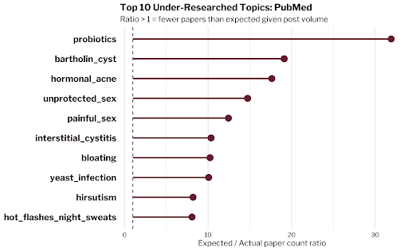
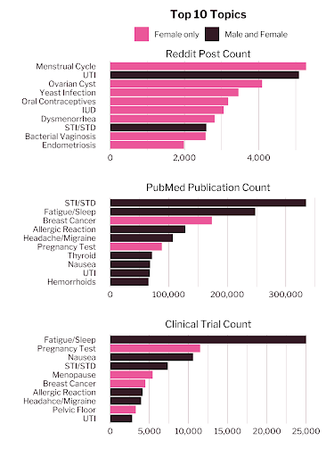

# Heard but Not Studied

### Mapping the Gap Between Health Research and Women's Lived Experiences

**Addison Gage** and **Shanti Brodnick** · Data 510 Capstone · School of Computing & Information Sciences, Willamette University · August 2026

---

Women make up just over half the global population, yet they have been systematically underrepresented in biomedical research for decades. This project asks a question that has not been answered quantitatively before: **of the health concerns women actually discuss, which ones has research neglected?** We applied topic modeling to 68,848 posts from Reddit's r/WomensHealth, mapped the resulting topics to search keywords, and used those keywords to pull the full publication history from PubMed and the full trial registry from ClinicalTrials.gov. Modeling research volume as a function of discussion volume let us calculate, for each topic, how much research *should* exist and compare it to how much actually does. Topics affecting both sexes turn out to receive roughly **3.8 times** the research of topics affecting only women, and a specific, rankable set of conditions falls far below what discussion volume would predict.



*Each point is one topic. The vertical gap between the two lines is the disparity: at any level of discussion, topics affecting both sexes have substantially more published research.*

---

## Project artifacts

| Artifact | Link |
|---|---|
| **Final write-up** (PDF) | [deliverables/M5-final/Capstone Final Write-up.pdf](<deliverables/M5-final/Capstone Final Write-up.pdf>) |
| **Poster** (PDF) | [deliverables/M3-poster-draft/FinalCapstonePoster.pdf](<deliverables/M3-poster-draft/FinalCapstonePoster.pdf>) |
| **Code repository** | [github.com/Addie-Shanti-Org/GenderDisparityinResearch](https://github.com/Addie-Shanti-Org/GenderDisparityinResearch) |
| **Project management** | [Project board](https://github.com/orgs/Addie-Shanti-Org/projects/3) · [Charter](CHARTER.md) · [Backlog](BACKLOG.md) |

**Datasets on Kaggle**

- [ClinicalTrials.gov, 1968–2026](https://www.kaggle.com/datasets/shanti33/womens-health-clinical-trials-dataset-1968-2026/data)
- [PubMed, 1786–2026](https://www.kaggle.com/datasets/shanti33/womens-health-pubmed-dataset-1786-2026)
- [r/WomensHealth posts and comments through Dec 2025](https://www.kaggle.com/datasets/addieg/reddit-postscomments-rwomenshealth-as-of-dec-25/data)

---

## Key results

**Topics affecting both sexes receive about 3.8× the research.** This holds independently across both sources: 3.85× for PubMed publications and 3.77× for ClinicalTrials.gov trials, controlling for how much each topic is discussed. Both coefficients are statistically significant.

**Seven topics have more than 10× fewer PubMed papers than their discussion volume predicts.**



Vaginal health probiotics leads at a 31.8 expected-to-actual ratio, followed by Bartholin cysts at 19.0. Hormonal acne, unprotected sex, painful sex, interstitial cystitis, and bloating round out the topics above 10×.

**The clinical trial gaps are wider still.** Bartholin cysts show an expected-to-actual trial ratio of 313.9 and hormonal acne 125.2, though trial counts are an order of magnitude smaller than publication counts, so these ratios are less stable.

**What women discuss and what gets researched barely overlap.** Eight of the ten most-discussed topics on r/WomensHealth affect women only. Among the ten most-published topics on PubMed, just two do.



Full methodology, model diagnostics, limitations, and the complete topic rankings are in the [write-up](deliverables/M5-final/).

---

## How it works

```
Reddit (Academic Torrents)  ─┐
                             ├─► BERTopic ─► keyword list ─┐
                             │                             │
PubMed API (PaperScraper)   ─┤                             ├─► PostgreSQL ─► negative binomial
ClinicalTrials.gov (PyTrials)┘◄────── queried by keyword ───┘                regression in R
```

1. **Collect.** Pull the complete r/WomensHealth post history from Academic Torrents; query PubMed and ClinicalTrials.gov by keyword across time blocks.
2. **Model topics.** Run BERTopic (`min_topic_size=50`, `nr_topics="auto"`) over 68,848 cleaned posts to surface 39 discussion clusters.
3. **Map.** Group c-TF-IDF keywords into 49 clinical topics with a hierarchy that assigns one topic per record, so specific diagnoses outrank general symptoms.
4. **Join.** Load posts, papers, and trials into a PostgreSQL database on Railway; a view aggregates counts per topic.
5. **Analyze.** Fit negative binomial regressions in R predicting paper and trial counts from log post count plus a sex-applicability indicator; rank topics by the ratio of expected to actual counts.

---

## Reproducing this project

**Requirements:** Python 3.12+, R 4.3+.

```bash
git clone https://github.com/Addie-Shanti-Org/GenderDisparityinResearch.git
cd GenderDisparityinResearch
pip install -r requirements.txt
```

**Getting the data.** Raw files are gitignored because of their size. The fastest path is to download the three Kaggle datasets linked above into `data/raw/`. To rebuild from source instead, run `notebooks/Article_Data_APIs/paperscraper.ipynb` and `notebooks/Article_Data_APIs/pytrials.ipynb` for the publication data, and download from AcademicTorrents for the Reddit archive.

**Running the analysis.**

| Step | File | Notes |
|---|---|---|
| Reddit pipeline (clean → topic model → count → map) | [`notebooks/Reddit_Data/`](notebooks/Reddit_Data/) notebooks `01`–`06` | Run in order; see that folder's README. `03_bertopic.ipynb` needs a GPU. |
| Publication pull | `notebooks/Article_Data_APIs/paperscraper.ipynb` | Long-running; API rate limits apply. |
| Trial pull | `notebooks/Article_Data_APIs/pytrials.ipynb` | Long-running; API rate limits apply. |
| Models and figures | `notebooks/RCode_Final_Models/Data_510_Capstone.Rmd` | Reads `topic_summary.csv`. Requires `MASS`, `dplyr`, `ggplot2`, `patchwork`, `showtext`. |

**Shortcut.** To reproduce the models and every figure without re-pulling anything, you only need `data/processed/topic_summary.csv` — 49 rows, one per topic, with post, paper, and trial counts. Knit `src/plotting_models.Rmd` against it and you'll get the full results.

---

## Ethics and data notice

**Reddit data.** Posts come from a public archive of r/WomensHealth. Usernames are dropped during cleaning and no post text, title, or comment content appears in any published output — only aggregate counts per topic. We recognize that these posts describe personal health experiences that people shared with a community, not with researchers, and we have tried to treat them accordingly.

**Publication data.** PubMed and ClinicalTrials.gov data were collected through their public APIs using open-source clients ([PaperScraper](https://github.com/jannisborn/paperscraper), [PyTrials](https://pypi.org/project/pytrials/)). Only metadata and raw counts were used.

**Scope constraints.** Results reflect two publication databases and one online community, and cannot be generalized to global women's health research or to all women's experiences. r/WomensHealth skews toward English-speaking users in the United States with internet access. This project examines sex-based disparity without accounting for the intersection of race and gender, or for people outside the gender binary who may be affected by conditions of the female reproductive system. The write-up discusses these limitations in full.

**Sex applicability coding.** Each topic was manually labeled as affecting both sexes or women only. This label directly influences expected counts, and therefore the gap rankings. The coding is documented in Appendix B of the write-up so that readers can evaluate it.

**Attributions.** Reddit archive by Watchful1 via [Academic Torrents](https://academictorrents.com/). Data sourced from the U.S. National Library of Medicine (PubMed) and ClinicalTrials.gov.

---

## The team

**Addison (Addie) Gage** — [argage@willamette.edu](mailto:argage@willamette.edu) · [GitHub](https://github.com/argage) · [LinkedIn](https://www.linkedin.com/in/addie-gage/)

**Shanti Brodnick** — [shanti@brodnick.com](mailto:shanti@brodnick.com) · [GitHub](https://github.com/shantibrodnick333) · [LinkedIn](https://www.linkedin.com/in/shantibrodnick/)

Developed for Data 510: Capstone under Professor Lucas Cordova, Willamette University.
